touying-greyc-ambrosia
------

`touying-greyc-ambrosia` is an _unofficial_ [Touying](https://github.com/touying-typ/touying) theme for creating presentation slides in [Typst](https://github.com/typst/typst).
It is intended for members of the [GREYC](https://www.greyc.fr/en/home/) lab, and is designed (by default) to mimic the official LaTeX & PPT templates provided in https://www.greyc.fr/intranet.
However, the theme comes with a lot of modifications and a range of different variants.
You are free to use or modify it for your own academic presentations, regardless of your affiliation.

## Features

### Flavors

`greyc-theme` offers five different flavors, inspired by existing touying and beamer themes.

| flavor |  1  |  2  |  3  |
|:------:|:---:|:---:|:---:|
| **`legacy`** |  | 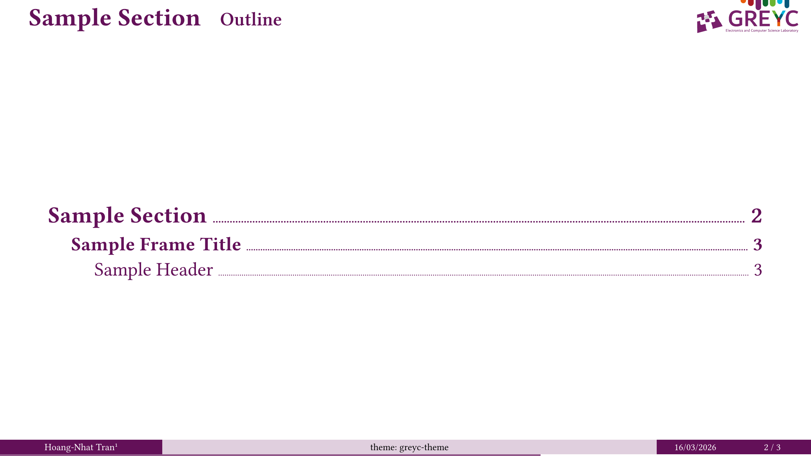 | 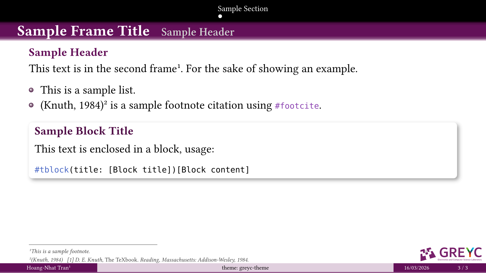 |
| `cambridge` | 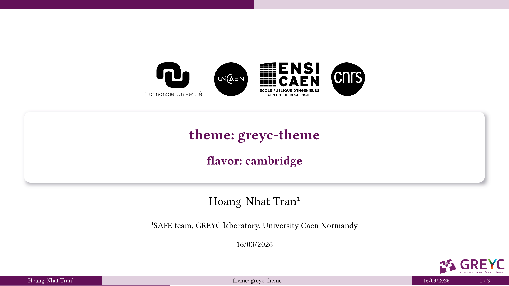 | 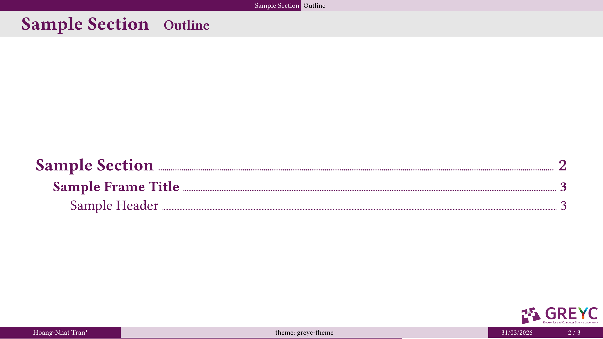 | 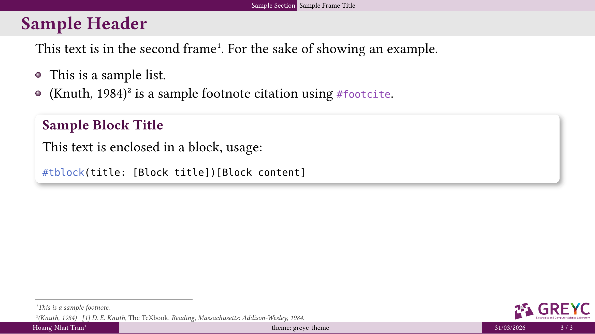 |
| `darmstadt` | 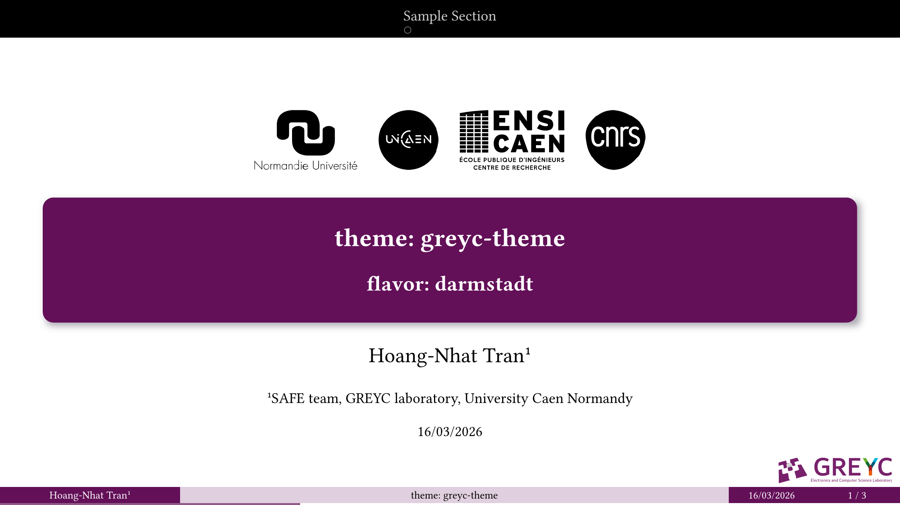 | 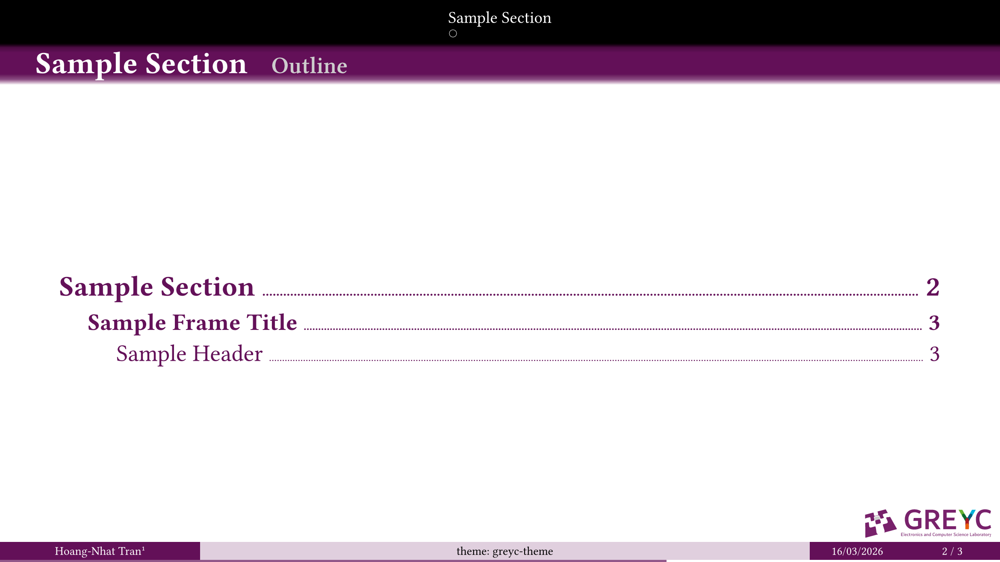 |  |
| `dewdrop` | 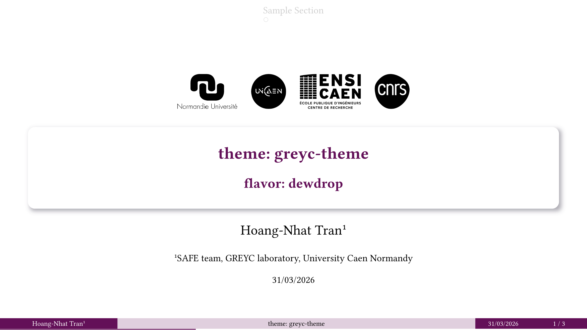 | 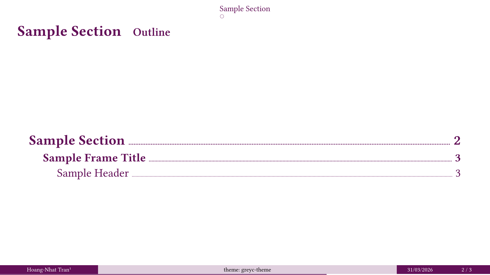 | 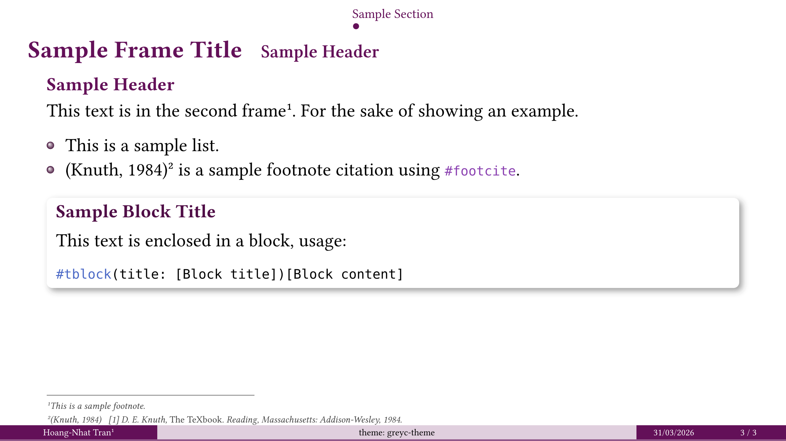 |
| `stargazer` | 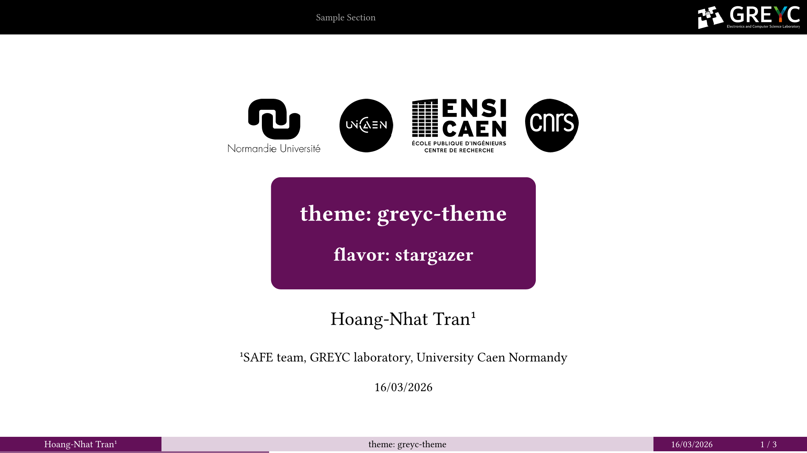 | 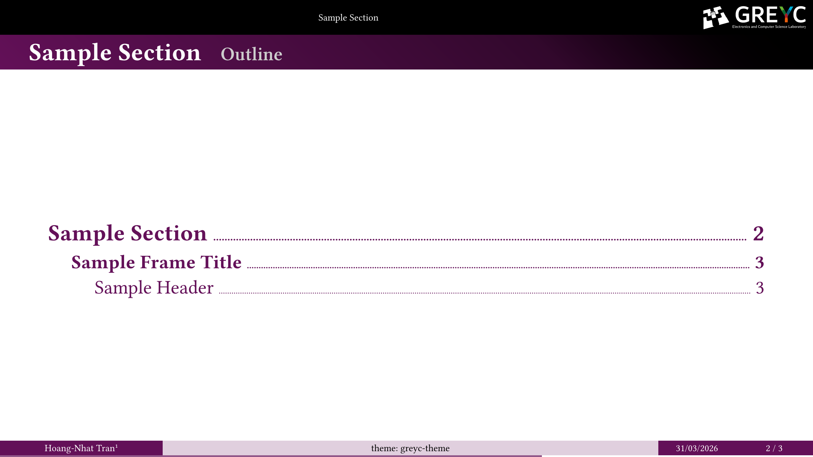 | 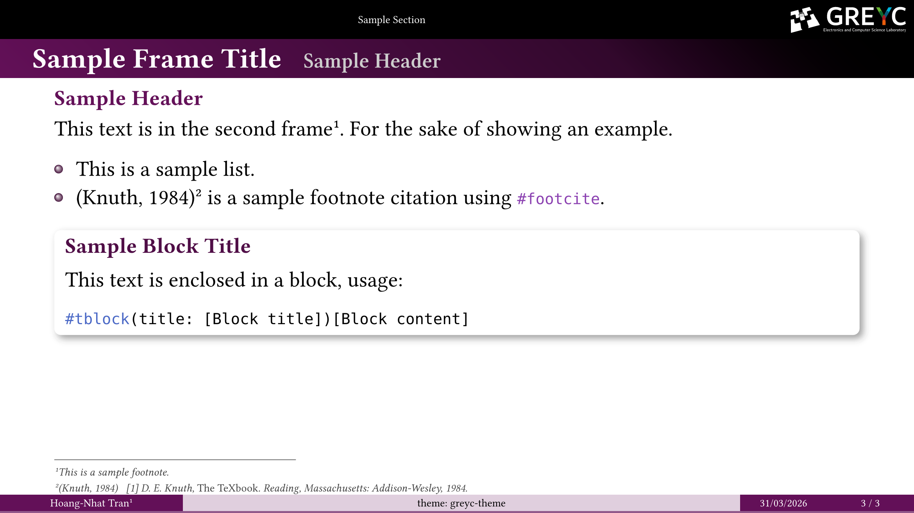 |

To select a flavor, you pass its name to the show rule of the theme.

```typ
#import "@preview/touying-greyc-ambrosia:0.1.0": *

#show: greyc-theme.with(
  flavor: "[flavor-name]",
  ..
)
```

### Other Functionalities

_more to be added_

#### Footnote Citation

- Instead of using the prose citation `@key`, we can use the `#footcite(<key>)` function, which further includes a full citation to the footnote of the same slide.
- At the end of the presentation, you must add your bibliography either by:
  - A separate bibliography slide.
  ```typ
  #bibliography-slide("bibliography.bib", style: "ieee")
  ```
  - A hidden bibliography.
  ```typ
  #hidden-bibliography("bibliography.bib", style: "ieee")
  ```

## Usage

For now, you can only download it manually:

```cmd
git clone https://github.com/inspiros/touying-greyc-ambrosia
```

In the near future, this theme will be available in the Typst universe.

```typ
#import "@preview/touying-greyc-ambrosia:0.1.0": *

#show: greyc-theme.with(
  // legacy | stargazer | dewdrop | cambridge | darmstadt
  flavor: "legacy",
  aspect-ratio: "16-9",
  config-info(
    title: [Title],
    subtitle: [Subtitle],
    author: [Author],
    date: datetime.today(),
    institution: [Institution],
  ),
)

#title-slide()

= Section Title

== Slide

#lorem(30)

#ending-slide()[
  Thanks for your attention!
]
```

### Examples

For more sophisticated use cases, please check [`examples/demo.typ`](examples/basic.typ) and [`examples/demo.pdf`](examples/basic.pdf).

## Fun Fact

*Ambrosia* is a food or drink of the Greek gods, often described as having every flavor imaginable.

## License

MIT licensed, see [LICENSE](LICENSE).
